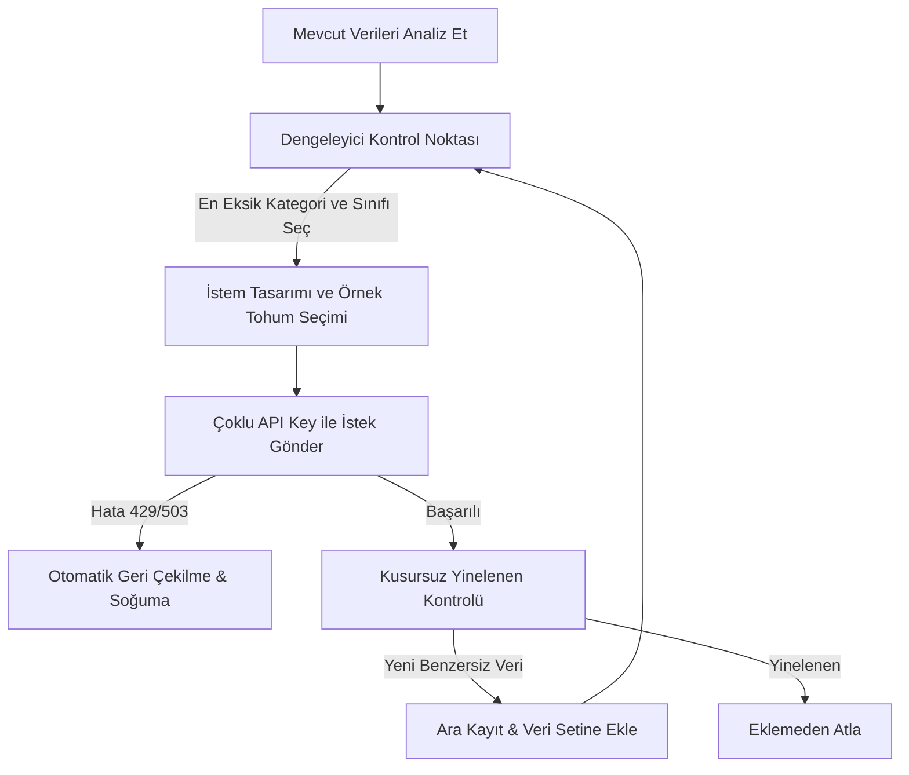

# 🚀 İstanbul Metre - Sentetik X (Twitter) Veri Üretim Kılavuzu

Bu kılavuz, İstanbul genelindeki duygu analizi modelimizi (BERTurk) eğitmek amacıyla kullanılan **5.000 adet dengeli sentetik Türkçe tweet veri setinin** nasıl üretildiğini, kullanılan akıllı algoritmaları ve gelecekte yeni sentetik veriler üretmek istediğinizde izlemeniz gereken adımları detaylı bir şekilde açıklar.

---

## 📌 1. Sentetik Veri Üretim Mimarisi (Neden ve Nasıl?)

Duygu analizi modellerinin gerçek hayattaki başarısı, eğitimde kullanılan verilerin **temiz, dengeli ve zengin** olmasına bağlıdır. Geleneksel yöntemlerle Twitter'dan doğrudan çekilen ham veriler genellikle:
* **Sınıf Dengesizliği (Class Imbalance):** Çoğunlukla aşırı negatif veya nötr olur, kaliteli pozitif veri bulmak çok zordur.
* **İroni ve Sarkazm Karmaşası:** Negatif sitem içeren ama gülücükle biten (Örn: *"ekonomi uçuyor maşallah :)"*) tweetler modelin kafasını karıştırır.

Bu engelleri aşmak için **Gemini API tabanlı ve Dengeleyici Algoritmalı Sentetik Veri Hattı** kurulmuştur.



---

## 🛠️ 2. Kullanılan Akıllı Teknolojiler ve Algoritmalar

### A. 📊 Dağılım Dengeleyici Sayaç Sistemi (Balancer Loop)
Üretecimiz sadece rastgele tweetler üretmez. Veri setinin hem **kategoriler bazında** hem de **sınıflar bazında** tam bir terazide kalmasını sağlar.

#### 📊 12'li Dengeleyici Matris ve Hücre Hedefleri Tablosu
5.000 tweetlik nihai hedef için 4 kategori ve 3 duygu sınıfından oluşan 12 hücreli dağılım matrisinin matematiksel hesabı şu şekildedir:

$$\text{Hücre Başına Hedef Veri} = \frac{\text{Toplam Hedef Veri (5000)}}{\text{Kategori Sayısı (4)} \times \text{Duygu Sınıfı Sayısı (3)}} = \frac{5000}{12} \approx 416.67 \text{ (Hücre Başına \approx 416-417 tweet)}$$

Bu matematiksel hedef doğrultusunda sistemin tam terazide kalması için koruduğu matris yapısı aşağıda gösterilmiştir:

| Kategori (Topic) | Sınıf 0 (Negatif) Hedef | Sınıf 1 (Nötr) Hedef | Sınıf 2 (Pozitif) Hedef | Kategori Toplamı (Satır) |
| :--- | :---: | :---: | :---: | :---: |
| **📉 Makro Ekonomi** | 416-417 | 416-417 | 416-417 | **1.250 Tweet** |
| **🚌 Ulaşım ve Lojistik** | 416-417 | 416-417 | 416-417 | **1.250 Tweet** |
| **🏢 Gayrimenkul ve İnşaat** | 416-417 | 416-417 | 416-417 | **1.250 Tweet** |
| **🏪 Ticaret ve Perakende** | 416-417 | 416-417 | 416-417 | **1.250 Tweet** |
| **📊 Sınıf Toplamları (Sütun)** | **1.666 - 1.667** | **1.666 - 1.667** | **1.666 - 1.667** | **5.000 Tweet (Nihai Hedef)** |

#### 📐 Dengeleyici Algoritmanın Matematiksel Çalışma Prensibi (Greedy Minimization)
Kod her döngüde (`while len(existing_records) < limit`), veri tabanındaki tüm hücreleri sayar ve aşağıdaki adımları sırasıyla uygular:

1. **Aç Hücreleri Belirleme:** `matrix_counts[cat][lbl] < 416` (hedefin altında kalan) tüm hücreler `incomplete_combos` listesine toplanır.
2. **Minimuma Öncelik Verme (Greedy Selection):** Listelenen aç hücreler, içlerindeki güncel veri miktarına göre küçükten büyüğe sıralanır:
   ```python
   # En az verisi olan kombinasyonu en başa alacak şekilde sırala
   incomplete_combos.sort(key=lambda x: x[2])
   cat, lbl, _ = incomplete_combos[0]
   ```
3. **Eşitleme İsteği:** Listenin en başındaki (yani veri miktarı en az olan, en geride kalmış) hücre seçilerek sadece o kategori ve o duygu sınıfı için Gemini API'ye istek atılır.
   * *Örnek:* Eğer veri tabanında `gayrimenkul_insaat` kategorisinin `Pozitif (2)` sınıfında 200 tweet, diğer tüm hücrelerde ise ortalama 300 tweet varsa; sistem sonraki tüm istekleri bu fark kapanana kadar sadece `gayrimenkul_insaat + Sınıf 2` ikilisi için çalıştırır.

Bu sayede, veri seti üretimi tamamlandığında ne kategoriler arası ne de sınıflar arası hiçbir sapma (skewness) veya dengesizlik kalmaz; tam bir matematiksel denge sağlanır.

### B. 🔑 Çoklu API Anahtarı Rotasyonu ve Hata Yönetimi
Ücretsiz Gemini API anahtarlarının dakikalık istek kotaları (RPM) çok düşüktür. Bunu aşmak için kodumuza şu mekanizmalar entegre edilmiştir:
1. **Çoklu Key Rotasyonu:** `.env` dosyasında tanımlanan tüm anahtarlar her istekte sırasıyla döner. Biri kilitlenirse otomatik diğerine geçilir.
2. **Dinamik Model Geçişi (Fallback):** En yeni model olan `gemini-3.5-flash` öncelikli olarak denenir, kotaları tükenirse sistem kesintisiz olarak `gemini-2.5-flash` modeline geçiş yapar.
3. **Akıllı Soğuma (Cooldown Delay):** Eğer tüm anahtarlar aynı anda 429 (Rate Limit) hatası verirse, sistem otomatik olarak **30 saniye boyunca soğumaya geçer** ve API havuzunun sıfırlanmasını bekler.

### C. 🛡️ Kusursuz Yinelenen Kontrolü (Deduplication)
Aynı kalıpların veya birbirinin kopyası cümlelerin veri setine girmesini engellemek için `strict_clean_for_duplicate` algoritması çalışır:
* Cümledeki tüm emojiler, noktalama işaretleri, büyük/küçük harf varyasyonları ve boşluklar temizlenir.
* Karakter bazında birebir veya aşırı benzer bir cümle daha önce üretilmişse, o yığın veri kümesine eklenmeden elenir.

---

## 📑 3. Konu Kategorileri, Anahtar Kelimeler ve Duygu Sınıfları

Duygu analizi boru hattımızda ve LLM veri üretiminde kullanılan tüm konu kategorileri, bunlara ait filtreleyici anahtar kelimeler ve duygu sınıflandırma tanımları aşağıda listelenmiştir.

### A. 📁 Konu Kategorileri ve Anahtar Kelime Filtreleri (Topics & Keywords)

Aşağıdaki kategoriler ve kelimeler, veri üretimi sırasında **dağılım dengesini korumak** ve **istek şablonlarını zenginleştirmek** için kod tabanında doğrudan rol oynar:

1. **📉 Makro Ekonomi (`makro_ekonomi`)**
   * *Açıklama:* Enflasyon, alım gücü, asgari ücret, faturalar ve genel geçim endeksleri.
   * *Anahtar Kelimeler:* `enflasyon`, `asgari ücret`, `pahalılık`, `alım gücü`, `zam geldi`, `geçim derdi`, `kredi kartı`, `maaş`, `gıda fiyatı`, `asgari ücretli`, `aylık gelir`, `milli gelir`, `gelir adaletsizliği`, `elektrik faturası`, `doğalgaz faturası`, `su faturası`, `dolar`, `ekonomi`, `euro`, `altın`, `borsa`, `döviz`.

2. **🚌 Ulaşım ve Lojistik (`ulasim_lojistik`)**
   * *Açıklama:* Toplu taşıma ücretleri, akaryakıt fiyatları, yol durumu ve İstanbul trafiği.
   * *Anahtar Kelimeler:* `mazot`, `benzin`, `akaryakıt zammı`, `akbil`, `iett zammı`, `toplu taşıma ücreti`, `taksi zammı`, `köprü geçiş ücreti`, `metrobüs zammı`, `marmaray ücreti`, `otobüs bileti`, `istanbul trafiği`, `trafik`.

3. **🏢 Gayrimenkul ve İnşaat (`gayrimenkul_insaat`)**
   * *Açıklama:* Kira artışları, ev sahibi-kiracı ilişkileri, konut fiyatları ve aidat ödemeleri.
   * *Anahtar Kelimeler:* `kira`, `ev sahibi`, `depozito`, `emlak`, `konut fiyatları`, `aidat`, `kiralık daire`, `satılık ev`, `ev fiyatı`, `konut kredisi`, `ev kirası`, `dükkan kirası`.

4. **🏪 Ticaret ve Perakende (`ticaret_perakende`)**
   * *Açıklama:* Esnaf durumu, market/mağaza etiket fiyatları, fahiş fiyat şikayetleri ve İTO faaliyetleri.
   * *Anahtar Kelimeler:* `esnaf`, `market fiyatları`, `pazar arabası`, `fahiş fiyat`, `etiket fiyatı`, `gramaj`, `mağaza fiyatları`, `işyeri kirası`, `ticaret odası`, `istanbul ticaret odası`, `ito başkanı`, `ito aidat`.

---

### B. 🛠️ Konuları ve Filtreleri Genişletme & Değiştirme Kılavuzu

Gelecekte yeni bir kategori eklemek, mevcut bir kategorideki anahtar kelimeleri genişletmek veya filtre mantığını değiştirmek isterseniz izlemeniz gereken adımlar ve kodun çalışma mantığı aşağıdadır:

#### 1. Kod İçerisindeki Tanımların Yeri
Tüm konu kategorileri ve bunlara bağlı filtreleyici anahtar kelimeler, [scripts/generate_dataset_llm.py](file:///c:/SoftWares/Python/python_project/istanbulmetre_cardiffnlp/scripts/generate_dataset_llm.py#L21-L44) dosyası içerisindeki `CATEGORIES` sözlüğünde (dictionary) tanımlanmıştır. 

```python
CATEGORIES = {
    "makro_ekonomi": ["enflasyon", "asgari ücret", ...],
    "ulasim_lojistik": ["mazot", "benzin", ...],
    ...
}
```

#### 2. Mevcut Bir Kategoriye Yeni Anahtar Kelimeler Ekleme
Eğer mevcut bir kategoriye yeni kelimeler (örneğin Ulaşım kategorisine `metro`, `metrobüs`, `hızlı tren`) eklemek istiyorsanız:
* `scripts/generate_dataset_llm.py` dosyasını açın.
* İlgili kategorinin listesine kelimeleri **tamamen küçük harflerle** ekleyin.
  > [!TIP]
  > Karşılaştırma mantığı küçük harfle yapıldığı için kelimelerin küçük harflerle yazılması önemlidir (örn: `metro`, `marmaray`).

#### 3. Tamamen Yeni Bir Kategori Ekleme (Örn: Çevre ve Belediye Hizmetleri)
Sisteme yepyeni bir konu başlığı eklemek için şu 3 basit adımı uygulayın:

* **Adım A: `CATEGORIES` Sözlüğüne Tanımı Ekleyin**
  Örneğin, `belediye_hizmetleri` adında yeni bir kategori ekleyelim:
  ```python
  CATEGORIES = {
      # ... mevcut kategoriler ...
      "belediye_hizmetleri": [
          "belediye", "ibb", "park", "bahçe", "altyapı", "su kesintisi", 
          "kentsel dönüşüm", "çöp", "temizlik", "kaldırım", "restorasyon"
      ]
  }
  ```

* **Adım B: Kodun Dengeleyici Mekanizmasının Otomatik Davranışı**
  Herhangi bir kategori eklediğinizde veya sildiğinizde kodda başka hiçbir yeri değiştirmeniz gerekmez! Kodun arkasındaki mimari dinamiktir:
  1. **Matris Genişlemesi:** Sistem artık `len(CATEGORIES) * 3` formülünü kullanarak matrisi otomatik olarak **15'li matrise** (5 kategori x 3 sınıf) çıkartır.
  2. **Otomatik Prompt Besleme:** Gemini'ye atılan prompt içerisindeki `{category.upper()}` alanı yeni kategoriyi, `{", ".join(CATEGORIES[category])}` alanı ise yeni tanımladığınız kelimeleri dinamik olarak çeker.
  3. **Dağılım Dengelemesi:** Kod ilk çalıştığında yeni kategorinin verileri sıfır olacağı için, dengeleyici algoritma (`matrix_counts[cat][lbl]`) otomatik olarak yeni kategoriye öncelik verir ve veri seti eşitlenene kadar sadece bu kategori için üretim yapar.

#### 4. Anahtar Kelime Filtreleme Algoritması Nasıl Çalışır?
Mevcut ve yeni üretilen tweetlerin hangi kategoriye ait olduğunu anlamak için kodda iki önemli aşama vardır:
* **Mevcut Verileri Sınıflandırma:** Kod [scripts/generate_dataset_llm.py](file:///c:/SoftWares/Python/python_project/istanbulmetre_cardiffnlp/scripts/generate_dataset_llm.py#L215-L233) içerisinde mevcut veriyi okurken, tweet metninin içinde o kategoriye ait anahtar kelimelerden biri geçiyor mu diye bakar. Eğer eşleşme bulursa, o tweeti o kategoriye yazar:
  ```python
  for r in existing_records:
      assigned = False
      for cat, keywords in CATEGORIES.items():
          if any(kw in r['text'].lower() for kw in keywords):
              matrix_counts[cat][r['label']] += 1
              r['category'] = cat
              assigned = True
              break
  ```
* **LLM Kelime Zorunluluğu:** LLM'e giden promptta yer alan *"Ürettiğin her tweetin içinde, verilen anahtar kelimeler listesinden en az bir veya iki tanesi doğal akışta MUTLAKA geçmelidir"* talimatı sayesinde üretilen yeni tweetlerin ilgili kategori filtrelerine %100 uyması garanti edilir.

---

### C. 🎭 Duygu Sınıfları ve Karar Kuralları
Duygu sınıflarının model tarafından hatasız öğrenilmesi için LLM'e verilen talimatlar bıçak gibi keskin kurallarla sınırlandırılmıştır:

* **🔴 Etiket 0: Negatif / İsyan / Sarkastik İroni**
  * *Normal Negatif:* Trafik çilesi, hayat pahalılığı, fahiş kiralar ve esnaf sitemleri.
  * *Sarkastik İroni (Çok Kritik!):* Kötü giden bir durumu sahte bir şekilde övüyormuş gibi yapıp sonuna gülücük (`:)`) koyan tweetler (Örn: *"Mazota yine zam gelmiş, şahlanıyoruz maşallah :)"*). Bu tarz tüm sarkastik tweetler **kesinlikle 0** olarak etiketlenir.

* **🟡 Etiket 1: Nötr / Resmi / Bilgilendirici**
  * *Tanım:* Hiçbir duygu barındırmayan, tarafsız belediye duyuruları, borsa/piyasa raporları, yol durumu bilgileri ve resmi ticaret odası açıklamaları.

* **🟢 Etiket 2: Pozitif / Gerçek Memnuniyet**
  * *Tanım:* Samimi bir sevinç, teşekkür, akıcı bir vapur keyfi, dürüst bir esnaf övgüsü veya kira artışında yardımcı olan ev sahibi teşekkürü.
  * *Gerçek Mutluluklu Gülücükler:* Cümlede gülücük (`:)`, `😊`) geçen ama kesinlikle ironi içermeyen, durumun gerçekten iyi olmasından duyulan samimi memnuniyetler (Örn: *"Sonunda aradığımız gibi bir ev bulduk İstanbul'da, her şey çok güzel gidiyor :)"*). Bunlar **kesinlikle 2** olarak etiketlenir.

---

## 🚀 4. Gelecekte Yeni Sentetik Veri Nasıl Üretilir?

Yarın bir gün veri setini **10.000'e genişletmek** veya tamamen yeni kategorilerle sıfırdan sentetik veri üretmek istediğinizde şu adımları izlemeniz yeterlidir:

### Adım 1: API Anahtarlarını Ayarlama
Proje kök dizinindeki `.env` dosyasını açın ve `GEMINI_API_KEY` kısmına yeni/güncel anahtarlarınızı virgülle ayırarak ekleyin:
```env
GEMINI_API_KEY=key1,key2,key3,key4
```

### Adım 2: Üretim Betiğini Çalıştırma
Bilgisayarınızda veya sunucunuzda terminali açıp sanal ortamı (virtual env) aktif ettikten sonra şu komutu çalıştırın:
```bash
python -u scripts/generate_dataset_llm.py --limit 10000 --batch_size 20 --output text,label,reason_10k.txt
```
* **Parametreler:**
  * `--limit`: Hedeflemek istediğiniz toplam tweet sayısı (Örn: 10000). Sistem mevcut dosyayı okuyup kaldığı sayıdan devam eder, sıfırdan başlamaz!
  * `--batch_size`: İstek başına üretilecek tweet sayısı (Genelde 20 idealdir).
  * `--output`: Çıktının kaydedileceği dosya yolu.

### Adım 3: Canlı İlerlemeyi İzleme
Verilerin anlık olarak nasıl üretildiğini, hangi anahtarların kullanıldığını ve dağılım matrisini canlı izlemek için yerleşik izleyicimizi çalıştırın:
```bash
python watch.py
```

---

## 📈 5. Veri Üretim Sonuç Özet Raporu (5K Final)

Üretilen nihai 5.017 tweetlik veri setinin (`text,label,reason_5k.txt`) kategorilerine ve duygu sınıflarına göre **gerçekleşen dağılım tablosu** aşağıda gösterilmiştir:

| Kategori (Topic) | Sınıf 0 (Negatif) Adet | Sınıf 1 (Nötr) Adet | Sınıf 2 (Pozitif) Adet | Kategori Toplamı (Satır) |
| :--- | :---: | :---: | :---: | :---: |
| **📉 Makro Ekonomi** | 480 | 440 | 438 | **1.358** |
| **🚌 Ulaşım ve Lojistik** | 410 | 398 | 405 | **1.213** |
| **🏢 Gayrimenkul ve İnşaat** | 446 | 470 | 442 | **1.358** |
| **🏪 Ticaret ve Perakende** | 349 | 372 | 367 | **1.088** |
| **📊 Sınıf Toplamları (Sütun)** | **1.685** | **1.680** | **1.652** | **5.017** |

### 🔍 Dağılım ve Denge Analiz Raporu

* **Sınıflar Arası Tam Denge:** En yüksek hacimli sınıf (Negatif: 1.685) ile en düşük hacimli sınıf (Pozitif: 1.652) arasındaki fark sadece **%1.9** düzeyindedir. Bu durum, modelin herhangi bir etiket lehine yanlı olmasını (prediction bias) engeller.
* **Konular Arası Homojenlik:** 4 ana konu başlığı da veri kümesinde 1.000 ila 1.350 arasında dengeli birer ağırlığa sahiptir. Bu durum, modelin duygu analizini tek bir konuya odaklanmadan, tüm sektörlerde genel yetenekle yapmasını sağlar.
* **Hazırlık:** Üretilen `text,label,reason_5k.txt` dosyası doğrudan local veya Google Colab üzerindeki **BERTurk 128k cased** eğitim scriptlerimize girdi olarak verilecek şekilde kusursuz formatlanmıştır.

---
